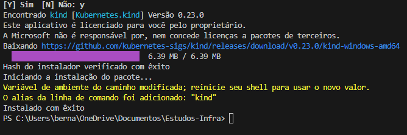
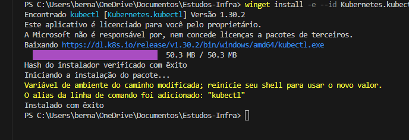

# kubernetes-local
kubernetes-local tests
### Vamos subir uma Stack de Kubernetes para trabalhar com wokloads de infra

Para isso vamos utilizar como cluster o kind:
https://kind.sigs.k8s.io/docs/user/quick-start#installation

Kubernetes

'winget install Kubernetes.kind'

Install kubectl
' winget install -e --id Kubernetes.kubectl '

## ------- ##

Nesse contexto para termos algo plausivel precisamos ter. Uma api, algo para monitorar essa api simples com alguma saida.
Podendo ser uma observabilidade simples de algum servico. Esse projeto não tem prazo. Os objetivos dele podem se alterar e também sempre procurando melhoria de automação como ate mesmo o MAKE.